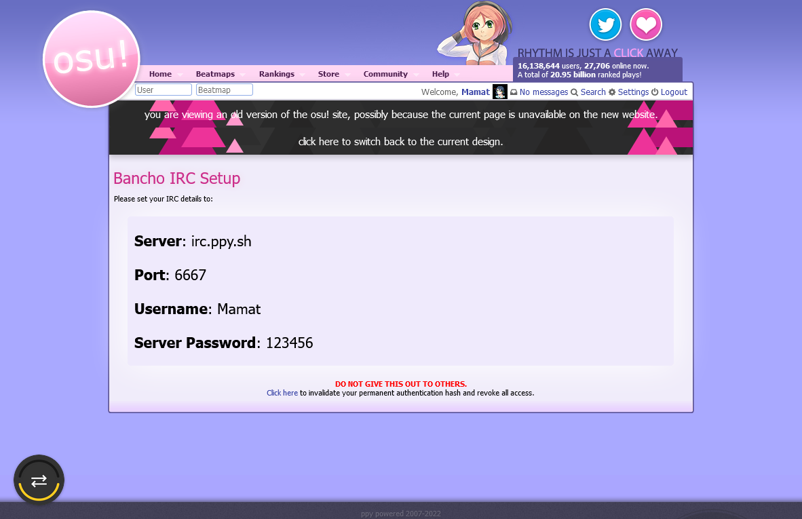

# osu-ahr Bot Configurations

Open your `local.json` file and edit section below to configure the bot's behavior.

## `irc` Section

This section is required to make bot running on [osu! IRC server](https://osu.ppy.sh/wiki/en/Community/Internet_Relay_Chat).

| Name | Type | Description |
|:--|:--|:--|
| `server` | `string` | Host name of osu! IRC server. The value always `"irc.ppy.sh"`. | 
| `nick` | `string` | Your osu! account nickname |
| `opt.port` | `number` | IRC port number. The value always `6667`. |
| `opt.password` | `string` | Your osu! IRC password, **not your osu! in-game password**. You can get it from [https://osu.ppy.sh/p/irc](https://osu.ppy.sh/p/irc). |



**Config Example**

```json
{
  "irc": {
    "server": "irc.ppy.sh",
    "nick": "Mamat",
    "opt": {
      "port": 6667,
      "password": "123456"
    }
  },
  ...
}
```

## `Lobby` Section

This section is dedicated for general config for multiplayer room

| Name | Type | Description |
|:--|:--|:--|
| `authorized_users` | `string[]` | List of authorized users or administrator. Authorized users can use [admin commands](/wiki/Command_List.md#administrator-commands) in all managed room. |
| `listref_duration_ms` | `number` | Time in milliseconds that bot can wait for a response from BanchoBot when room referee type `!mp listref` command. |
| `info_message` | `string` | Message that appear if player use `!info` or `!help` command. Use `\n` to split message into several message. |
| `info_message_cooltime_ms` | `number` | Cool down period for `!info` command usage in milliseconds. |
| `stat_timeout_ms` | `number` | Time in milliseconds that bot can wait for a response from BanchoBot when player type `!stats <username>` command. |
| `info_message_announcement_interval_ms` | `number` | Interval time where info message is sent periodically. Set this name as `0` to disable it. |
| `transferhost_timeout_ms` | `number` | Countdown timer in milliseconds where bot will wait until next host is appointed. |

**Config Example**

```json
{
  ...
  "Lobby": {
    "authorized_users": ["meowhal", "Mamat"], 
    "listref_duration_ms": 1000,
    "info_message": "Welcome to osu-ahr room!\nThe second item is displayed on the second line.\nToo many lines will result in a silent penalty",
    "info_message_cooltime_ms": 60000,
    "stat_timeout_ms": 5000,
    "info_message_announcement_interval_ms": 60000,
    "transferhost_timeout_ms": 5000
  },
  ...
}
```

## `AfkKicker` Section

This section is dedicated to determine which player is AFK and if the player reach certain threshold, the player will be kicked from the room.

| Name | Type | Description |
|:--|:--|:--|
| `enabled` | `boolean` | Activate/Deactivate `AfkKicker` plugin |
| `threshold` | `number` | Total threshold point before player get kicked from the room, see [`threshold` specification](/wiki/Bot_Configuration.md#threshold-specification) for more info |
| `cooltime_ms` | `number` | Cooldown time between afk judgments (in milliseconds) |

### `threshold` specification

Total `threshold` follow these point system:

1. If player finish the match with 0 score, then this player receive additional 2 penalty points.
2. If player didn't participate in match because missing map, then this player receive additional 2 penalty points.
3. If bot receive "Afk" information from `!stats <playerName>` command on player, then this player receive additional 3 penalty points.


**Config Example**

```json
{
  ...
  "AfkKicker": {
    "enabled": true,
    "threshold": 6,
    "cooltime_ms": 30000
  },
  ...
}
```

## `AutoHostSelector` Section

This is the core section of the bot. It configure how auto host selection works.

| Name | Type | Description |
|:--|:--|:--|
| `show_host_order_after_every_match` | `boolean` | Enable or disable auto send message containing player queue list. |
| `host_order_chars_limit` | `number` | Host-order messages are truncated to this length. For example, current order of a room are the following: meowhal, Mamat, -Forest-. If the value is equals to `12`, then it will trim to "meowhal, Ma" and "..." is appended so the result will be "host order: meowhal, Ma..." |
| `host_order_cooltime_ms` | `number` | Cooldown time between host-order messages. |
| `deny_list` | `string[]` | Players contained in this list are not added to the host queue in all managed room. |

**Config Example**

```json
{
  ...
  "AutoHostSelector": {
    "show_host_order_after_every_match": true,
    "host_order_chars_limit": 90,
    "host_order_cooltime_ms": 15000,
    "deny_list": ["bad_guy_1", "bad_guy_2"]
  },
  ...
}
```

## `AutoStartTimer` Section

This section is used for configuring match starter countdown timer that automatically activate after the host selects a map.

| Name | Type | Description |
|:--|:--|:--|
| `enabled` | `boolean` | Activate/Deactivate `AutoStartTimer` feature |
| `doClearHost` | `boolean` | Bot will revoke host access by sending `!mp clearhost` command after the timer starts. |
| `waitingTime` | `number` | Countdown timer in seconds for auto start after host pick a map. |

**Config Example**

```json
{
  ...
  "AutoStartTimer": {
    "enabled": true,
    "doClearHost": false,
    "waitingTime": 90
  },
  ...
}
```

## `CacheCleaner` Section

This section is used to clean cache used for match history, beatmap, and profile fetchers.

| Name | Type | Description |
|:--|:--|:--|
| `enabled` | `boolean` | Activate/Deactivate auto cache cleaner |
| `intervalMs` | `number` | Interval in millisecond for auto cache cleaner if enabled |

**Config Example**

```json
{
  ...
  "CacheCleaner": {
    "enabled": true,
    "intervalMs": 86400000
  },
  ...
}
```

## `HistoryLoader` Section

This section is used to fetch match history in managed room.

| Name | Type | Description |
|:--|:--|:--|
| `fetch_interval_ms` | `number` | Time period in millisecond between fetching the match history |

**Config Example**

```json
{
  ...
  "HistoryLoader": {
    "fetch_interval_ms": 0
  },
  ...
}
```

## `HostSkipper` Section

This section used for host-skip vote and automatic afk host skipper.

| Name | Type | Description |
|:--|:--|:--|
| `vote_rate` | `number` | Percentage of votes required to skip (range from 0.0 to 1.0). For example, if there are 16 players and the rate is 0.5, 8 players are required to vote to make it pass. |
| `vote_min` | `number` | Minimum required vote count. |
| `vote_cooltime_ms` | `number` | Cooldown time in milliseconds for the next vote. |
| `vote_msg_defer_ms` | `number` | Cooldown time in milliseconds for vote progress message. |
| `afk_check_timeout_ms"` | `number` | Waiting time for `!stats <playerName>` command result. |
| `afk_check_interval_first_ms` | `number` | Period in milliseconds before first afk host check. |
| `afk_check_interval_ms` | `number` | Interval period to check if the host is afk. |
| `afk_check_do_skip` | `boolean` | Automatically skips afk hosts. |

**Config Example**

```json
{
  ...
  "HostSkipper": {
    "vote_rate": 0.5,
    "vote_min": 2,
    "vote_cooltime_ms": 5000,
    "vote_msg_defer_ms": 5000,
    "afk_check_timeout_ms": 5000,
    "afk_check_interval_first_ms": 45000,
    "afk_check_interval_ms": 90000,
    "afk_check_do_skip": true
  },
  ...
}
```

## `LobbyKeeper` Section

This section is used to preserve current room setting.

| Name | Type | Description |
|:--|:--|:--|
- `mode` : `null | { "team": number, "score": number }` keep lobby mode.
  - team  => 0: Head To Head, 1: Tag Coop, 2: Team Vs, 3: Tag Team Vs
  - score => 0: Score, 1: Accuracy, 2: Combo, 3: Score V2
- `size` : `number` keep lobby size.
- `password`: `null | string` keep password.
- `mods` : `null | string` keep mods.
- `hostkick_tolerance`:`integer` Number of players kicked by the host before host is kicked for abuse.
- `title` : `null | string` keep the lobby title.
```json
{
 ...
 "LobbyKeeper": {
    "mode": {"team": 2, "score": 1 },
    "size": 16,
    "title": "4-5 auto host rotation"
  }
  ...
}
```

## LobbyTerminator Section
- `terminate_time_ms` : `number` period of time to wait before closing the lobby for inactivity.
## MapChecker Section
- `enabled`: `boolean` Enable map checker.
- `star_min`: `number` change lower difficulty cap. 0 means no cap.
- `star_max`: `number` change lower difficulty cap. 0 means no cap.
- `length_min`: `number` change minimum allowed song length (seconds). 0 means no cap.
- `length_max`: `number` change maximum allowed song length (seconds). 0 means no cap.
- `gamemode`: `string` specify game mode in the room (osu, taiko, fruits, mania).
- `num_violations_allowed`: `number` Number of times violations are allowed.  0 means unlimited.
- `allow_convert`: `boolean` Allows conversion of maps for alternate game modes.
## MatchStarter Section
!start vote configs
- `vote_rate` : `number(0.0 - 1.0)` number of votes required to start.
- `vote_min`: `number` minimum required vote count.
- `vote_msg_defer_ms` : `number` cooldown time for vote progress message.
- `start_when_all_player_ready` : `boolean` starts the match when everyone is ready.
## MatchAborter Section
!abort vote and auto abort configs
- `vote_rate` : `number(0.0 - 1.0)` number of votes required to abort.
- `vote_min`: `number` minimum number of votes required to abort.
- `vote_msg_defer_ms` : `number` cooldown time for vote progress message.
- `auto_abort_rate`: `integer` number of players required to have finished before automatic match abortion.
- `auto_abort_delay_ms`: `number` number of milliseconds to wait before executing abort command.
- `auto_abort_do_abort`: `boolean` enable match abortion.
## WordCounter Section
Used to measure the amount of bot messages 
## OahrCli Section 
- `invite_users` : `string[]` players to be invited when the bot makes a new lobby.
- `password` : `string` default lobby password; empty("") if you don't need password.
## WebApi Section
- `client_id`: `number`, webapi client id. you can make client at [https://osu.ppy.sh/home/account/edit](https://osu.ppy.sh/home/account/edit)
  - optional. the bot uses the WebApi instead of webpage to get the beatmap info.
- `client_secret`: `string` webapi client secret
- `token_store_dir`: `string`, don't care
- `asGuest`: `true` set true
- `callback`: `string`,
- `callback_port`: `number`